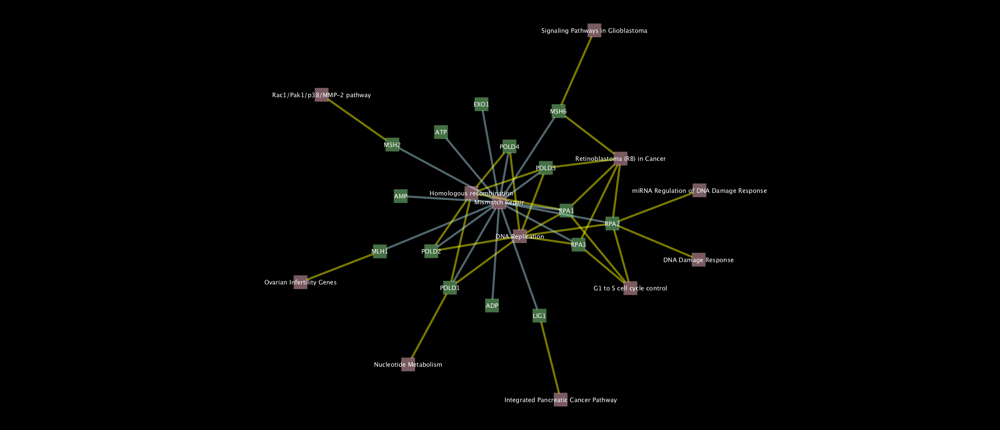

##Description

Given a pathway identifier from wikipathways, the code generates a network of related genes and pathways. 
Keep cytoscape open while running code. please note that the code will start a new session in Cytoscape. 

The code curently generates network for DNA mismatch repair pathway in homo sapiens. Identifier: WP3381.

Custom Style
Background: black
pathway nodes: pink
Gene nodes : green

Gene-Pathway edge in yellow..
Pathway-Gene edge in blue.

Network that will be generrated in cytoscape with a custom defined style.



```
def foo():
   helloworld()
```

#Analysis

|--------+-------------------+---------------|
| Sample |          Coverage |         Depth |
|--------+-------------------+---------------|
| Test   | 57.08913125235051 | 1660.85408048 |
| Test   | 74.94358781496804 | 3184.72912749 |
| Test   | 89.64836404663407 | 27180.9173561 |
| Test   | 88.16284317412561 | 28458.7620346 |
| Test   |  91.5757803685596 | 30795.4355961 |
| Test   |  86.4704776231666 |  21326.125141 |
| Test   |  88.6987589319293 | 30874.4148176 |
| Test   |  86.1790146671681 | 29461.5839601 |
| Test   | 94.22715306506205 |  27032.291463 |
| Test   | 89.46972546069951 | 28757.5010342 |
| Test   |  83.1327566754419 | 20835.5057352 |
| Test   | 82.54042873260624 | 20882.1413125 |
| Test   | 88.27566754418955 | 38246.9635201 |
|--------+-------------------+---------------|

#Testing
